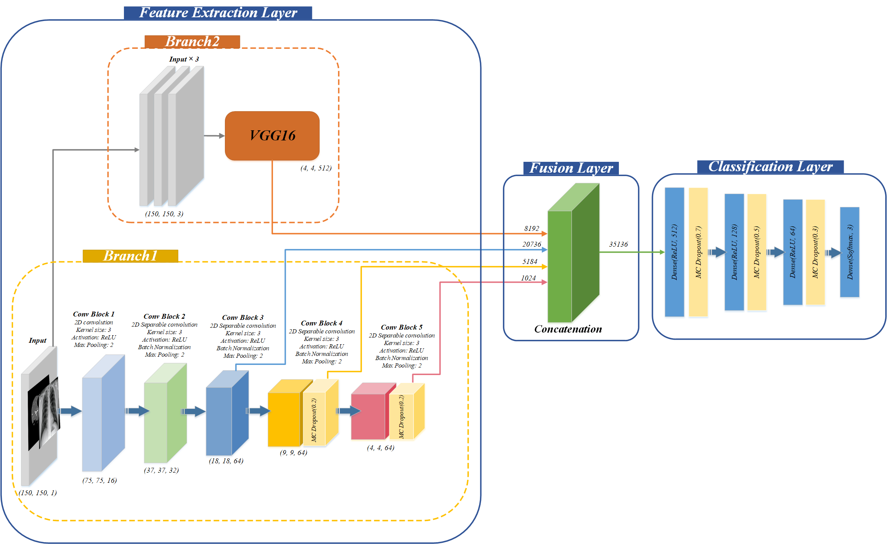
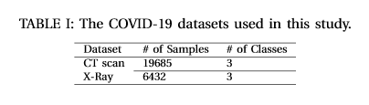

# UncertaintyFuseNet
This repository contains the code of the following paper: "UncertaintyFuseNet: Robust Uncertainty-aware Hierarchical Feature Fusion with Ensemble Monte Carlo Dropout for COVID-19 Detection"

# Abstract
The COVID-19 (Coronavirus disease 2019) pandemic has become a major global threat to human health and well-being. Thus, the development of computer-aided detection (CAD) systems that are capable of accurately distinguishing COVID-19 from other diseases using chest computed tomography (CT) and X-ray data is of immediate priority. Such automatic systems are usually based on traditional machine learning or deep learning methods. Differently from most of the existing studies, which used either CT scan or X-ray images in COVID-19-case classification, we present a new, simple but efficient deep learning feature fusion model, called __UncertaintyFuseNet__, which is able to classify accurately large datasets of both of these types of images. We argue that the uncertainty of the model's predictions should be taken into account in the learning process, even though most of the existing studies have overlooked it. We quantify the prediction uncertainty in our feature fusion model using effective Ensemble Monte Carlo Dropout (EMCD) technique. A comprehensive simulation study has been conducted to compare the results of our new model to the existing approaches, evaluating the performance of competing models in terms of Precision, Recall, F-Measure, Accuracy and ROC curves. The obtained results prove the efficiency of our model which provided the prediction accuracy of 99.08\% and 96.35\% for the considered CT scan and X-ray datasets, respectively. Moreover, our __UncertaintyFuseNet__ model was generally robust to noise and performed well with previously unseen data.
# Packages Used
Pandas, Tensorflow 2.0, Keras, Sklearn, Numpy, Matplotlib

# Proposed Architecture of UncertaintyFuseNet




# Datasets
Details of the COVID-19 datasets used in this study with some random samples: 




## Credits
This work has been published by Information Fusion Journal, and you can find it in this [link](https://www.sciencedirect.com/science/article/pii/S1566253522001609?via%3Dihub). To access Arxiv version please see this [link](https://arxiv.org/abs/2105.08590).

## Reference

```
@article{abdar2023uncertaintyfusenet,
  title={UncertaintyFuseNet: robust uncertainty-aware hierarchical feature fusion model with ensemble Monte Carlo dropout for COVID-19 detection},
  author={Abdar, Moloud and Salari, Soorena and Qahremani, Sina and Lam, Hak-Keung and Karray, Fakhri and Hussain, Sadiq and Khosravi, Abbas and Acharya, U Rajendra and Makarenkov, Vladimir and Nahavandi, Saeid},
  journal={Information Fusion},
  volume={90},
  pages={364--381},
  year={2023},
  publisher={Elsevier}
}
```

----------
In case of any questions, bugs, suggestions or improvements, please feel free to contact us.

