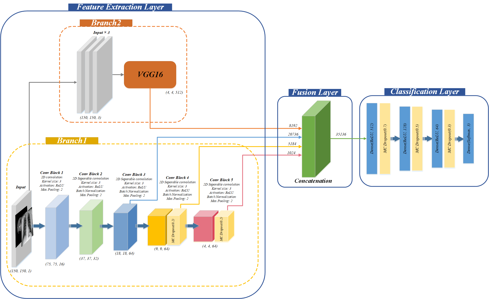
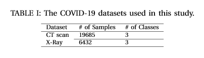
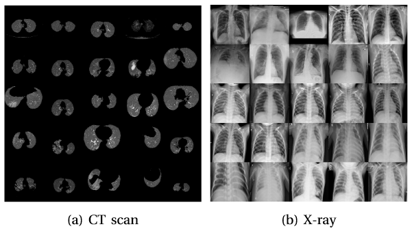

# UncertaintyFuseNet: Robust Uncertainty-aware Hierarchical Feature Fusion with Ensemble Monte Carlo Dropout for COVID-19 Detection
This repository contains the code of the following paper: "UncertaintyFuseNet: Robust Uncertainty-aware Hierarchical Feature Fusion with Ensemble Monte Carlo Dropout for COVID-19 Detection"

# Abstract
The COVID-19 (Coronavirus disease 2019) has infected more than 151 million people and caused approximately 3.17 million deaths around the world up to the present. The rapid spread of COVID-19 is continuing to threaten human’s life and health. Therefore, the development of computer-aided detection (CAD) systems based on machine and deep learning methods which are able to accurately differentiate COVID-19 from other diseases using chest computed tomography (CT) and X-Ray datasets is essential and of immediate priority. Different from most of the previous studies which used either one of CT or X-ray images, we employed both data types with sufficient samples in implementation. On the other hand, due to the extreme sensitivity of this pervasive virus, model uncertainty should be considered, while most previous studies have overlooked it. Therefore, we propose a novel powerful fusion model named $UncertaintyFuseNet$ that consists of an uncertainty module: Ensemble Monte Carlo (EMC) dropout. The obtained results prove the effectiveness of our proposed fusion for COVID-19 detection using CT scan and X-Ray datasets. Also, our proposed $UncertaintyFuseNet$ model is significantly robust to noise and performs well with the previously unseen data. 

# Packages Used
pandas, tensorflow, keras, sklearn, numpy, matplotlib

# Proposed Architecture of UncertaintyFuseNet

# Datasets
Details of the COVID-19 datasets used in this study with some random samples: 

# Detailed Results
The detailed results are available in the paper: 
